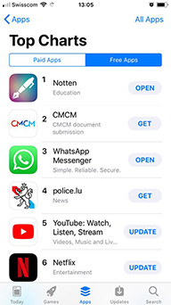
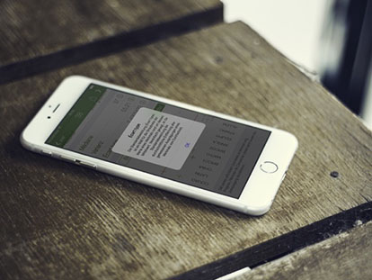

# Notten

Notten is an iOS App written in Objective-C and Swift. It ranked number 1 in the Luxembourgish App Store and was downloaded 6950 times during its lifetime. 

## Description

Notten is a very powerful mathematical item that helps Luxembourgish students deal with their school grades. Available for both Enseignement Secondaire Classique and Technique. It provides the following functionalities:

* Save your grades into the corresponding terms and subjects
* Term and year averages 
* Change app color
* Influence of a subject on your general average
* Median, variance and standard deviation
* Minimum required grades to get a sufficient average
* See wether you pass the year or have a retake exam
* Progress and overview with beautiful charts and graphs
* Register multiple classes simultaneously
* Export function

Available in English, French and Luxembourgish.
 

## A few screenshots

 &nbsp;&nbsp;  &nbsp;&nbsp; 

